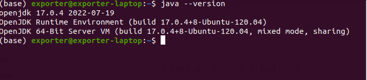
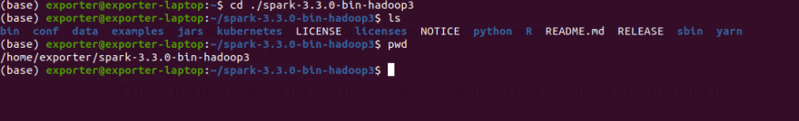
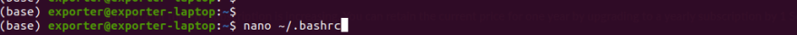
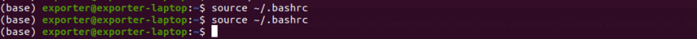
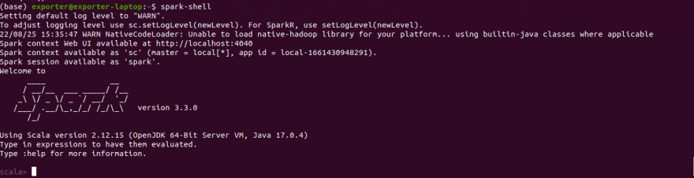
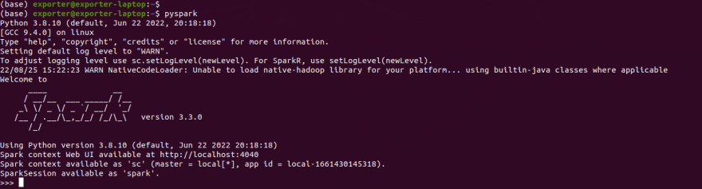

# To install Apache Spark and run Pyspark in Ubuntu
## Ubuntu

Instalación de Apache Spark en nuestro Ubuntu 22.04 y también nos aseguraremos de que nuestro Pyspark se esté ejecutando sin errores.

Apache Spark es una de las mejores herramientas para un ingeniero de datos para procesar datos de cualquier tamaño. En este artículo, explicaré los pasos para instalar Apache Spark utilizando ejemplos y capturas de pantalla de mi máquina para ayudarlo a evitar cualquier error.

## ¿Qué es Apache Spark y para qué se utiliza?

Apache Spark es un motor de análisis unificado para el procesamiento de datos a gran escala en una máquina de un solo nodo o en múltiples clústeres. Es una herramienta de código abierto, lo que significa que no tienes que pagar para descargarla y usarla. Spark utiliza el almacenamiento en memoria caché y la ejecución de consultas optimizadas para permitir consultas analíticas rápidas para cualquier tamaño de datos dado. Proporciona API de alto nivel en Java, Scala, Python y R, y admite gráficos de ejecución generales. Spark admite la reutilización de código en múltiples cargas de trabajo, incluido el procesamiento por lotes, análisis en tiempo real, procesamiento de gráficos, consultas interactivas y aprendizaje automático.

## ¿Cómo funciona Apache Spark?

Spark realiza el procesamiento en memoria, reduciendo el número de pasos en un trabajo y reutilizando datos en múltiples operaciones paralelas. Con Spark, solo se necesita un paso: los datos se leen en memoria, se realizan las operaciones y los resultados se escriben de nuevo, lo que resulta en una ejecución mucho más rápida. Spark también reutiliza datos utilizando una caché en memoria, lo que acelera en gran medida los algoritmos de aprendizaje automático que llaman repetidamente a una función en el mismo conjunto de datos. Creamos DataFrames para lograr la reutilización de datos, que es una abstracción sobre el conjunto de datos distribuido resistente (RDD). RDD es una colección de objetos que se almacena en caché en memoria y se reutiliza en múltiples operaciones de Spark. Esto reduce drásticamente la latencia, ya que Apache Spark se ejecuta 100 veces más rápido en memoria y 10 veces más rápido en disco que Hadoop MapReduce.

## Cargas de trabajo de Apache Spark

### Spark Core

Spark Core es el motor de ejecución general subyacente de la plataforma Spark, sobre el cual se construye toda la funcionalidad. Es responsable de distribuir y supervisar trabajos, administración de memoria, recuperación de fallas, programación e interacción con sistemas de almacenamiento. Spark Core se expone a través de una interfaz de programación de aplicaciones (API) desarrollada para Java, Scala, Python y R.

### Spark SQL

Spark SQL realiza consultas interactivas para datos estructurados y semiestructurados. Es un motor de consulta distribuido que proporciona consultas interactivas de baja latencia hasta 100 veces más rápidas que MapReduce. Spark SQL incluye un optimizador basado en costos, almacenamiento columnar y generación de código para consultas rápidas, al tiempo que se escala a miles de nodos.

### Spark Streaming

Spark Streaming es una solución en tiempo real que aprovecha la capacidad de programación rápida de Spark Core para realizar análisis en tiempo real. Ingesta datos en mini lotes y realiza transformaciones de RDD (conjuntos de datos distribuidos resistentes) en esos mini lotes de datos.

### Biblioteca de aprendizaje automático (MLib)

Spark incluye MLlib, una biblioteca de algoritmos para el aprendizaje automático en datos a gran escala. Los científicos de datos pueden entrenar modelos de aprendizaje automático con R o Python en cualquier fuente de datos de Hadoop, guardarlos usando MLlib e importarlos en un pipeline basado en Java o Scala.

### GraphX

Spark GraphX es un marco de procesamiento de gráficos distribuido construido sobre Spark. GraphX proporciona ETL, análisis exploratorio y cálculo de gráficos iterativo para permitir a los usuarios construir y transformar interactivamente una estructura de datos de gráficos a gran escala. También proporciona un tiempo de ejecución optimizado para esta abstracción.

## Beneficios clave de Apache Spark:

- Velocidad: Spark puede ejecutar aplicaciones en un clúster de Hadoop hasta 100 veces más rápido en memoria y 10 veces más rápido cuando se ejecuta en disco. Esto se logra al reducir el número de operaciones de lectura/escritura en disco y almacenar datos de procesamiento intermedios en memoria. A través del almacenamiento en memoria caché y la ejecución de consultas optimizadas, Spark puede ejecutar consultas analíticas rápidas sobre datos de cualquier tamaño.

- Soporte para múltiples lenguajes: Apache Spark admite nativamente Java, Scala, R y Python, lo que te brinda una variedad de lenguajes para construir tus aplicaciones.

- Múltiples cargas de trabajo: Apache Spark puede ejecutar múltiples cargas de trabajo, incluyendo consultas interactivas, análisis en tiempo real, aprendizaje automático y procesamiento de gráficos.

Ahora que tenemos una comprensión básica de Apache Spark, podemos proceder con la instalación en nuestras máquinas.

## Pasos de instalación

Para descargar Apache Spark en Linux, necesitamos tener Java instalado en nuestra máquina.

Para verificar si tienes Java instalado, usa el siguiente comando:

```
java --version
```

Por ejemplo, en mi máquina, Java está instalado:



En caso de que no tengas Java instalado, usa los siguientes comandos para instalarlo:

```
sudo apt update
sudo apt install default-jdk -y
```

Verifica la instalación de Java:

```
java --version
```

Tu versión de Java debería ser la versión 8 o posterior.

### Instalar Python

```
sudo apt install python3-pip

```

### Instalar Apache Spark

Primero, instala los paquetes requeridos usando el siguiente comando:

```
sudo apt install curl mlocate git opencv-python-headless scala -y
```

Descarga Apache Spark. Encuentra la última versión en la página de descargas:

```
wget https://dlcdn.apache.org/spark/spark-3.5.1/spark-3.5.1-bin-hadoop3.tgz
```

Reemplaza la versión que estás descargando de la página de descargas de Apache con el enlace de arriba.

Extrae el archivo descargado usando el siguiente comando:

```
tar xvf spark-3.5.1-bin-hadoop3.tgz
```

Asegúrate de especificar el nombre de archivo correcto que has descargado. El comando anterior extrae el archivo descargado en el directorio donde lo descargaste. Toma nota del directorio de ruta para tu archivo Spark.

Por ejemplo, en mi máquina, el directorio del archivo Spark aparece como se muestra en la imagen:



Una vez que hayas completado los pasos anteriores, has descargado correctamente Apache Spark. Ahora, configuremos el entorno de Spark.

## Configuración del entorno de Spark

Para configurar el entorno de Spark, debes establecer algunas variables de entorno en el archivo de configuración `bashrc`.

Accede al archivo `bashrc` usando tu editor preferido. Por ejemplo, para abrir el archivo en el editor nano, usa el siguiente comando:

```
sudo nano ~/.bashrc
```



Ten en cuenta que este es un archivo con información sensible, así que no elimines ninguna línea. Desplázate hasta el final del archivo y agrega las siguientes líneas para asegurarte de que podamos usar Spark correctamente:

```
export SPARK_HOME=/home/exporter/spark-3.3.0-bin-hadoop3
export PATH=$PATH:$SPARK_HOME/bin
export SPARK_LOCAL_IP=localhost
export PYSPARK_PYTHON=/usr/bin/python3
export PYTHONPATH=$(ZIPS=("$SPARK_HOME"/python/lib/*.zip); IFS=:; echo "${ZIPS[*]}"):$PYTHONPATH
```

Recuerda reemplazar `<tu directorio de instalación de Spark>` con tu directorio de instalación de Spark real. Por ejemplo, el mío está configurado como:

```
export SPARK_HOME=/home/exporter/spark-3.3.0-bin-hadoop3
```

Guarda el archivo `bashrc` sin cambiar nada más. La siguiente imagen muestra cómo aparece el final de mi archivo `bashrc` después de agregar las variables de entorno:


Después de salir del archivo `bashrc` desde el editor nano, debes guardar las variables. Usa el siguiente comando:

```
source ~/.bashrc
```



La imagen de arriba muestra cómo escribir el comando. Escribí el comando dos veces, pero solo necesitas escribirlo una vez.

## Ejecutando Spark Shell

Ahora que has configurado el entorno de Spark, puedes verificar si Spark está funcionando como se espera ejecutando el Spark shell con el siguiente comando:

```
spark-shell
```

Si las variables están configuradas correctamente, deberías ver una salida similar a esta:



## Ejecutando Pyspark

Para ejecutar Pyspark, usa el siguiente comando:

```
pyspark
```

Si las variables están configuradas correctamente, deberías ver una salida similar a esta:



En este artículo, hemos proporcionado una guía de instalación para Apache Spark en Ubuntu 22.04, incluidas las dependencias necesarias. También hemos descrito el proceso detallado de configuración del entorno de Spark.

Este artículo debería facilitarte la comprensión de Apache Spark y su instalación. No dudes en proporcionar comentarios y sugerencias.

